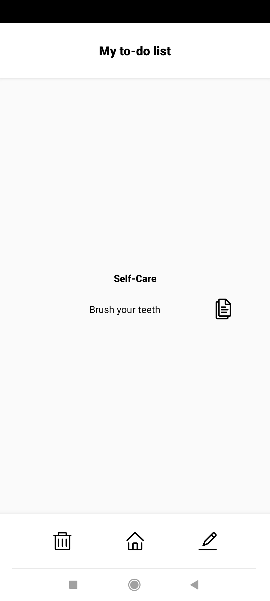
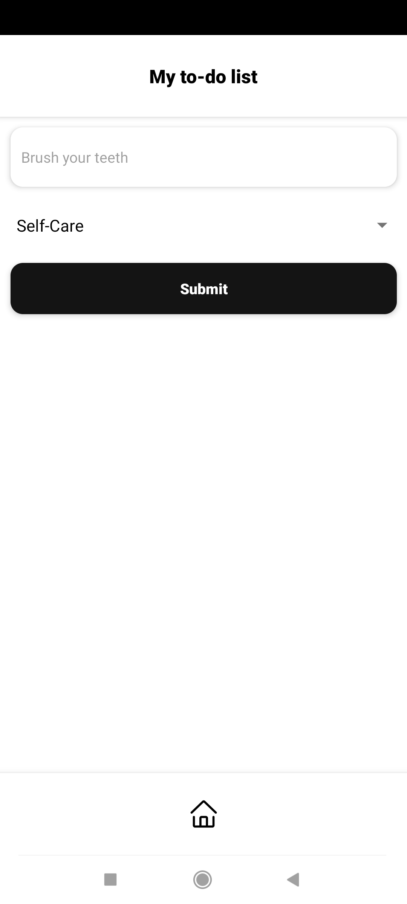

# My React Native To-Do App

## Overview

This is a React Native application designed to help users manage their daily tasks efficiently. The app allows users to add, search, and filter tasks based on different categories. It leverages modern React features such as hooks and context to manage state and provide a seamless user experience.

## Features

- **Add Tasks**: Users can add new tasks with a description and category.
- **Edit Tasks**: Users can edit tasks with a description and category.
- **Delete Tasks**: Users can delete tasks.
- **Search Tasks**: Users can search for tasks using a search bar.
- **Filter Tasks**: Users can filter tasks by categories such as Health, Household, Learning, Leisure, Self-Care, Shopping, Social, and Work.
- **Responsive UI**: The app features a responsive and user-friendly interface.

## Technologies Used

- **React Native**: For building the mobile application.
- **React Hooks**: For managing state and side effects.
- **React Context**: For global state management.
- **PropTypes**: For props validation.
- **react-native-vector-icons**: For icons.

## Screenshots

<table style="margin: 0 auto; border-collapse: collapse;">
  <tr>
    <td style="text-align: center; border: none; padding: 10px;"><h3>Home Screen</h3></td>
    <td style="text-align: center; border: none; padding: 10px;"><h3>Home Screen With Filter</h3></td>
    <td style="text-align: center; border: none; padding: 10px;"><h3>Home Screen With Search</h3></td>
  </tr>
  <tr>
    <td style="text-align: center; border: none; padding: 10px;"></td>
    <td style="text-align: center; border: none; padding: 10px;"></td>
    <td style="text-align: center; border: none; padding: 10px;"></td>
  </tr>
  <tr>
    <td style="text-align: center; border: none; padding: 10px;"><h3>Add Screen</h3></td>
    <td style="text-align: center; border: none; padding: 10px;"><h3>Chosen Task Screen</h3></td>
    <td style="text-align: center; border: none; padding: 10px;"><h3>Edit Screen</h3></td>
  </tr>
  <tr>
    <td style="text-align: center; border: none; padding: 10px;"></td>
    <td style="text-align: center; border: none; padding: 10px;"></td>
    <td style="text-align: center; border: none; padding: 10px;"></td>
  </tr>
</table>

## Code Structure

- **components/**: Contains all the reusable components.
- **screens/**: Contains the main screens of the app.
- **context/**: Contains the context and provider for global state management.

## Acknowledgements

- Icons provided by [react-native-vector-icons](https://github.com/oblador/react-native-vector-icons).

